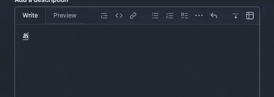
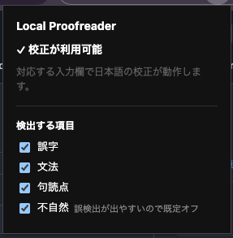

# Local Proofreader

_[English](./README.md) | [日本語](./README.ja.md)_

> プライバシー重視の日本語校正アシスタント（Chrome 拡張）。Web の入力欄に打った日本語を、
> **完全に端末内で**（Chrome 組み込みの Gemini Nano で）チェックします。クラウドには一切送りません。

<!-- デモ動画/GIF をここに置きます: docs/demo.gif -->



## できること

入力中に、誤字・文法・句読点・不自然な言い回しなどの「直したほうがよさそうな箇所」に波線を引き、
カーソルを合わせると訂正案と理由を表示。クリックでその箇所だけを直せます。勝手に書き換えることはありません。

## 特長

- 🔒 **完全オンデバイス** — 入力テキストは端末の外に出ません（クラウド送信なし・ログイン不要）
- 〰️ 入力しながら、怪しい箇所に**リアルタイムで波線**
- 💬 波線を **hover / クリック** → 訂正案 + 理由 → **適用**でその箇所だけ修正
- ✋ **自動訂正はしない** — 直すかどうかはあなたが決める
- 🧩 普通の入力欄（`textarea` / `input`）に加え、**Slack や Gmail のようなリッチエディタにも対応**
- ⚙️ 検出する種類（誤字 / 文法 / 句読点 / 不自然）を popup で **ON/OFF**。
  「不自然」は過剰訂正を避けるため**既定オフ**。

## 動作要件

- **Chrome 149 以降**（日本語がそのまま使える）、または Chrome 148 + フラグ（Setup 参照）
- デスクトップのみ: macOS 13+ / Windows 10,11 / Linux（Android・iOS 非対応）
- モデル用に**空き 22GB 程度**、GPU **VRAM 4GB 超** または **RAM 16GB + 4コア以上**
- 初回に Gemini Nano モデル（数 GB）が一度だけダウンロードされます

## 導入手順

1. **（Chrome 148 の場合）日本語を有効化**
   - `chrome://flags/#optimization-guide-on-device-model` → **Enabled**
   - `chrome://flags/#prompt-api-for-gemini-nano` → **Enabled multilingual**
   - Chrome を再起動
2. **ビルドして拡張を読み込む**
   ```sh
   pnpm install
   pnpm build
   ```
   `chrome://extensions` を開き、**デベロッパーモード**を ON →「**パッケージ化されていない拡張機能を読み込む**」→
   `.output/chrome-mv3` フォルダを選択。
3. **準備完了の確認** — 拡張の popup を開き、**「✓ 校正が利用可能」**が出れば OK。
   モデル未取得なら、ダウンロードボタンを押す（初回のみ・数 GB）。

## 使い方

1. 任意の入力欄（コメント欄、Slack / Gmail のメッセージなど）にカーソルを置き、日本語を入力。
2. 怪しい箇所に赤い波線が出ます。
3. 波線に hover / クリック → 訂正案と理由がツールチップに表示。
4. **適用**を押すと、その箇所だけが置換されます。
   一部のエディタでは「適用」が未対応です（ツールチップに表示されます）。その場合は手動で修正してください。
5. popup を開くと、検出する種類を ON/OFF できます。

<!-- ポップアップのスクリーンショットをここに: docs/popup.png -->



## プライバシー

すべて Chrome 組み込みの Gemini Nano で端末内処理されます。入力テキストはどのサーバーにも送られず、
アカウントも不要です。ネットワーク通信は、Chrome 自身が行う初回のモデルダウンロードのみです。

## 対応範囲

- **対応:** 普通の `textarea` / `input[type=text]`、および多くの `contenteditable` エディタ（Slack・Gmail など）。
- 一部のリッチエディタでは**「適用」が未対応**のことがあります（検出・波線は機能。手動で修正可）。
- **対象外:** パスワード / 検索 / メール欄（意図的に除外）、コードエディタ、Google Docs（canvas 描画のため）。

## 開発者向け

セットアップ・コマンド・設計メモは [CLAUDE.md](./CLAUDE.md) を参照してください。
